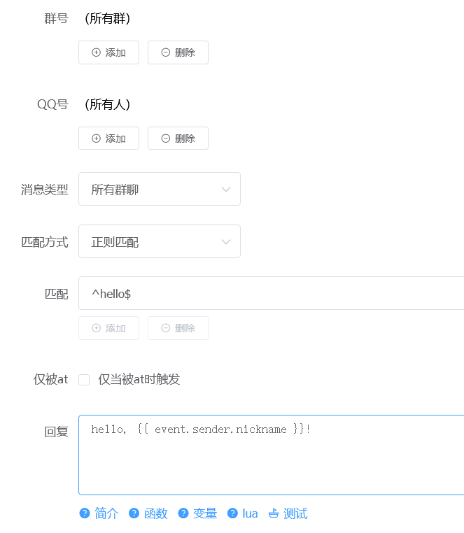

# gypsum

石膏自定义

交流 QQ 群：238627697

gypsum 是受到 [铃心自定义](http://myepk.club/) 的启发，基于 [ZeroBot](https://github.com/wdvxdr1123/ZeroBot) 的实现可视化控制台


<details>
  <summary>（展开预览图）</summary>



</details>

## 用法

gypsym 需要配合 onebot 使用，例如：[go-cqhttp](https://go-cqhttp.org/)、[onebot-mirai](https://github.com/yyuueexxiinngg/onebot-kotlin)、[node-onebot](https://github.com/takayama-lily/node-onebot)、[XQ-HTTP](https://discourse.xianqubot.com/t/topic/50)等

1. 修改 `onebot` 的配置文件，启用`正向ws`
1. 在 [release](https://github.com/yuudi/gypsum/releases/latest) 中下载可执行文件
1. 启动一次 `gypsum`，生成 `gypsum_config.toml` 配置文件
1. 向 `gypsum_config.toml` 配置文件中填写`正向ws`连接参数、网页端口、账号、密码
1. 启动 `onebot` ，再启动 `gypsum`
1. 打开 `<你的ip地址>:9900`，开始使用

### 一键脚本

Windows 用户可以使用一键脚本快速安装 `gypsum` 与 `gocqhttp`

打开 powershell 并执行

```powershell
iwr "https://cdn.jsdelivr.net/gh/yuudi/gypsum`@master/scripts/gypsum-gocqhttp-installer.ps1" -O .\ginstall.ps1 ; ./ginstall.ps1 ; rm ginstall.ps1
```

如果提示没有权限，可以先执行

```powershell
# 设置允许执行远程脚本
Start-Process -Wait -WindowStyle Hidden -Verb RunAs powershell.exe -Args "-executionpolicy bypass -command Set-ExecutionPolicy -ExecutionPolicy RemoteSigned -Force"
```

### Docker

```shell
docker pull ghcr.io/yuudi/gypsum
docker run --rm -v ${PWD}/gypsum:/gypsum ghcr.io/yuudi/gypsum
# 修改 gypsum/gypsum_config.toml 文件后
docker rum -d -v ${PWD}/gypsum:/gypsum --name gypsum ghcr.io/yuudi/gypsum
# 最好同时将 gypsum 目录挂载至 gocqhttp 容器，以便共享文件
```

### 模板

详见[模板说明](./docs/template.md)

## todo

### 1.0

- [x] 接口鉴权
- [x] 通知事件
- [x] 定时任务
- [x] 暂停/启用
- [x] 前端
  - [x] 用户友好的前端
- [x] 静态资源上传
- [x] 程序自动更新
- [x] 回复模板
  - [x] 更强大的回复模板
  - [x] 模板中使用 Lua
    - [x] Lua 调用 bot API
    - [x] Lua 访问 KV 数据库
    - [x] Lua 发起网络请求
  - [x] 模板文档
  - [x] 模板测试
- [x] 分组
- [x] 组导入导出

### 1.1+

- [ ] 更强大的前端编辑器
- [ ] 内置频率控制器
- [ ] 内置积分系统
